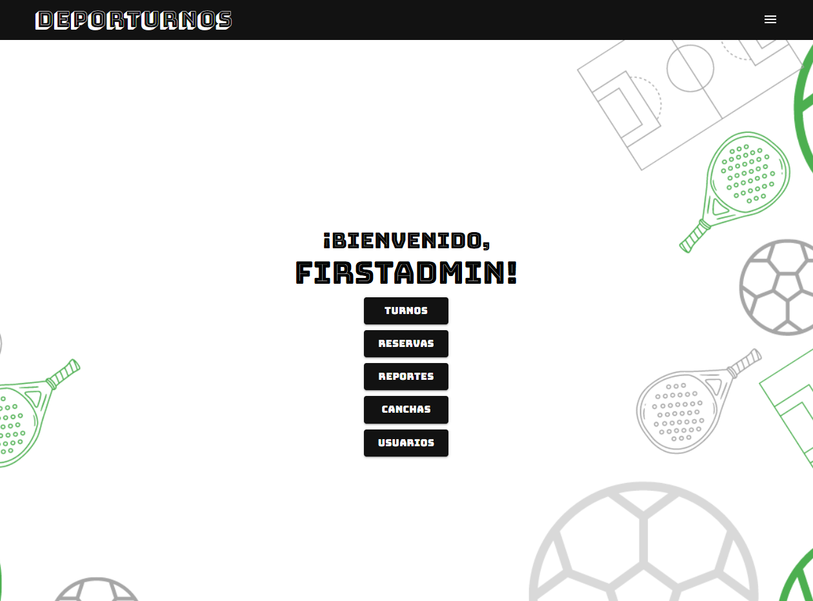
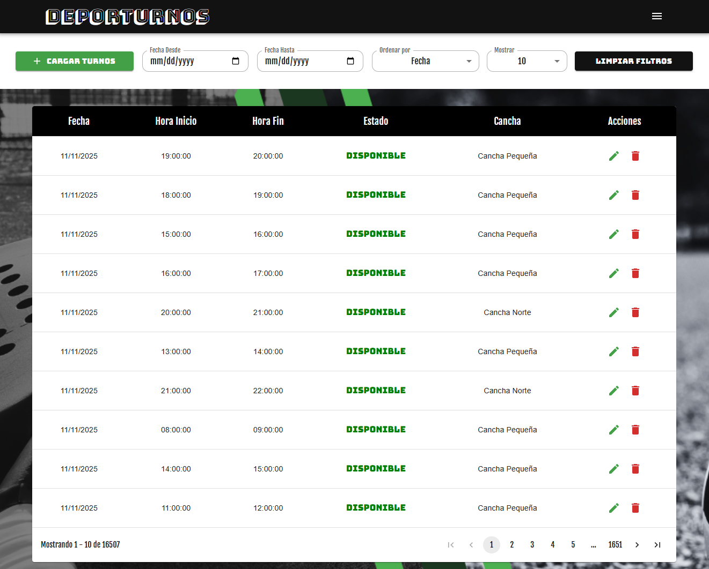
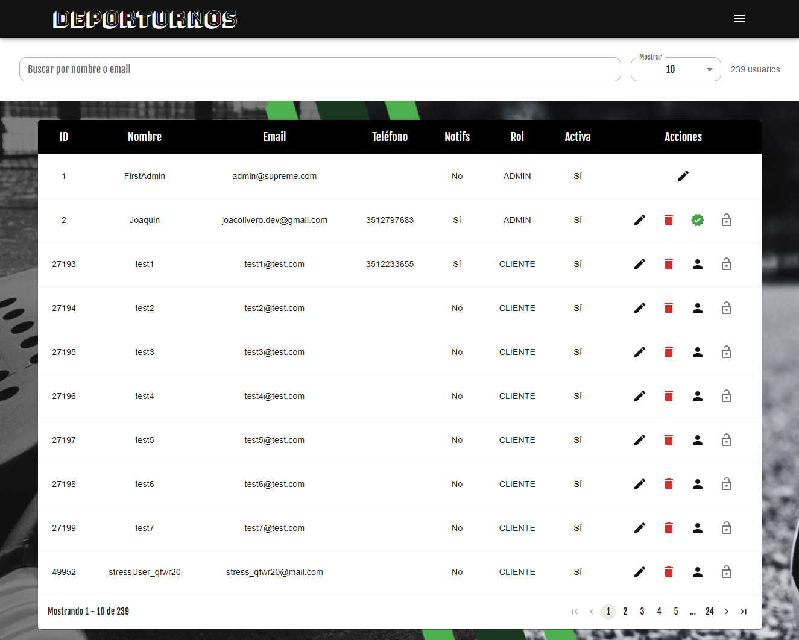
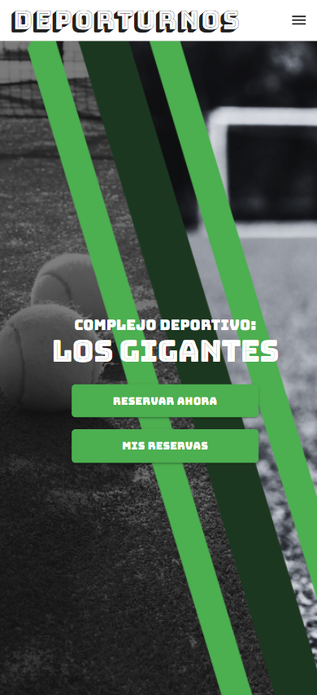
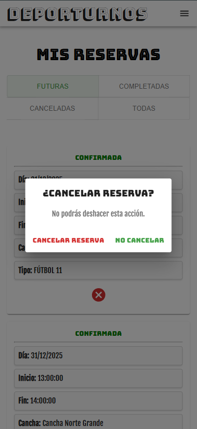

# DeporTurnos Frontend

  

Welcome to the frontend repository for **DeporTurnos**, a modern web platform for the integral management of sports centers.
Built with **React** and **Vite**, this application offers a responsive and intuitive user interface for managing reservations, users, and administrative tasks, seamlessly communicating with the DeporTurnos Backend.

## 📸 App Gallery

  <strong>Admin Interface (Desktop)</strong>

  

  
  

  <strong>Client Experience (Mobile)</strong>

  
  

## Features

- **Modern & Responsive UI:** Designed with **Material-UI (MUI)** to ensure a polished look and feel across devices.
- **Role-Based Navigation:** Distinct interfaces and workflows for **Admins** (management) and **Clients** (booking), managed via React Router.
- **Secure Integration:** Handles authentication securely using **JWT (JSON Web Tokens)** storage and decoding.
- **Optimized State Management:** Efficient handling of application state for a smooth user experience.
- **Fast Build Times:** Powered by **Vite** for rapid development and optimized production builds.

## Tech Stack

- **React:** Core JavaScript library for building user interfaces.
- **Vite:** Next-generation frontend tooling.
- **Material-UI (MUI):** Comprehensive React UI component library.
- **React Router:** Standard routing library for React.
- **Axios:** Promise-based HTTP client for Backend API communication.
- **JWT-decode:** For decoding tokens and managing user sessions.
- **Date-fns / Dayjs:** Robust date manipulation libraries.

## Project Structure

~~~bash
deporturnos-front
├── public
├── src
│   ├── assets
│   │   └── images
│   ├── components      # Reusable UI components
│   ├── pages
│   │   ├── admin       # Admin-specific views (Dashboard, Management)
│   │   └── client      # Client-specific views (Booking, Profile)
│   ├── services
│   │   └── api.js      # Axios configuration and API calls
│   ├── App.css
│   ├── App.jsx         # Main Layout and Routing
│   └── main.jsx        # Entry point
├── package.json
└── vite.config.js
~~~

## Installation and Usage

1. **Clone the repository:**
   ~~~bash
   git clone https://github.com/Pulpoide/deporturnos-front.git
   cd deporturnos-front
   ~~~

2. **Install dependencies:**
   ~~~bash
   npm install
   ~~~

3. **Environment Configuration:**
   Ensure the frontend knows where the backend is running. Create a `.env` file in the root if necessary (or check `src/services/api.js` default config).
   ~~~env
   VITE_API_URL=http://localhost:8080
   ~~~

4. **Run the development server:**
   ~~~bash
   npm run dev
   ~~~

## Related Repository

This is the frontend client. For the API logic, database structure, and performance tests, please visit the backend repository:
* [**DeporTurnos Backend Repository**](https://github.com/Pulpoide/deporturnos-back)

---

## Author
**Joaquin D. Olivero** Full Stack Developer | Backend Specialist

